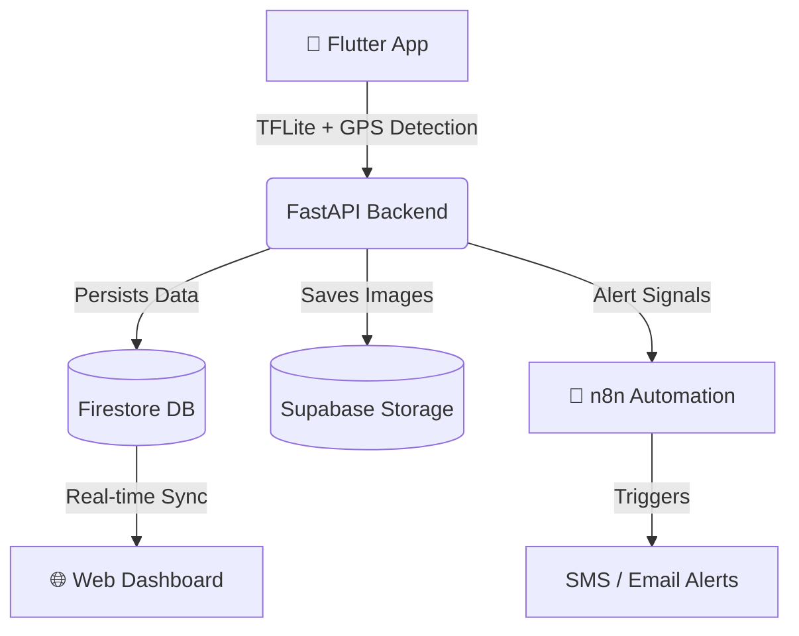

<div align="center">
  <h1>🔥 Agniveer — Wildfire Detection & Surveillance System</h1>
  <p>
    <strong>End-to-End Real-Time Wildfire Detection Platform</strong>
  </p>
  <p>
    
    
    
    
    
  </p>
</div>

<br />

A powerful, full-stack platform designed to detect wildfires in real-time. Agniveer utilizes on-device AI for immediate detection on mobile devices, routes data through a resilient FastAPI backend, stores it in Firebase, visualizes it on a live web dashboard, and automatically triggers multi-channel emergency alerts using n8n workflows.

---

## 📑 Table of Contents

- [Architectural Overview](#%EF%B8%8F-architectural-overview)
- [Key Features](#-key-features)
- [Tech Stack](#%EF%B8%8F-tech-stack)
- [Project Layout](#-project-layout)
- [Getting Started](#-getting-started)
  - [Docker Installation (Recommended)](#1-docker-installation-recommended)
  - [Manual Installation](#2-manual-installation)
- [Environment Configuration](#-environment-configuration)
- [API Reference](#-api-reference)
- [Troubleshooting](#-troubleshooting)

---

## 🏗️ Architectural Overview

Agniveer separates functionality into a mobile capture utility, a central processing API, and a visualization dashboard.



---

## ✨ Key Features

- **📱 Mobile TFLite Detection**: Edge-AI capabilities detecting wildfires on the device camera without latency.
- **📍 Real-Time GPS & Geocoding**: Automatically tags locations and finds the nearest geographical fire stations.
- **✉️ Automated Multi-Channel Alerts**: Instantly triggers SMS (Twilio), Email (SMTP), and Push notifications (FCM) when a fire is classified as Critical.
- **🌐 Live Telemetry Dashboard**: Complete Leaflet-based map UI with real-time Firebase listeners, statistics, charting, and customizable dark modes. 
- **🔐 Secure Auth**: Role-based access driven by JWT token authentication and Firebase Identity integration.
- **🐳 Deep Docker Support**: One-command `docker-compose` spins up the Backend, Frontend Reverse Proxy, and the Automation Engine directly.

---

## 🛠️ Tech Stack

| Domain | Core Technology | Supporting Tools |
| :--- | :--- | :--- |
| **Mobile** | Flutter & Dart | TFLite (YOLOv8 Custom Object Detection) |
| **Backend API** | Python (FastAPI) | PyJWT, Pydantic, Uvicorn |
| **Realtime Database** | Google Firestore | Firebase Admin SDK |
| **Image Storage** | Supabase Storage | `supabase-py` |
| **Frontend Site** | Vanilla JS & HTML5 | TailwindCSS, Leaflet.js, Chart.js |
| **Automations**| n8n | Twilio (SMS), SMTP Nodes |
| **DevOps** | Docker | Nginx, Docker Compose |

---

## 📂 Project Layout

```text
Project_Fire/
├── automation/                 # n8n workflows and FCM Credentials guides
├── backend/                    # Python FastAPI application
│   ├── api/                    # Core logic, Services, Routers
│   ├── .env                    # Secrets (Generated from config template)
│   └── requirements.txt        # Python backend dependencies
├── config/                     # Global .env templates
├── database/                   # Firebase access rules & schemas
├── docker/                     # Dockerfiles & docker-compose configurations
├── frontend_website/           # Real-time web surveillance interface
└── mobile_app/flutter_app/     # Flutter mobile application
```

---

## 🚀 Getting Started

### 1. Docker Installation (Recommended)

The system provides a containerized orchestration file to bring everything up locally in one step.

```bash
# Clone the repository
git clone https://github.com/vinaykumarbharwal/Project_Fire.git
cd Project_Fire

# Setup environment variables (Edit this file with your actual keys)
cp config/.env.example backend/.env

# Build and start the compose stack
cd docker
docker-compose up --build
```
> **Services Running at:**
> - Web Dashboard: `http://localhost:80`
> - API & Swagger Docs: `http://localhost:8000/api/docs`
> - Automation Engine (n8n): `http://localhost:5678`

---

### 2. Manual Installation

If you prefer building and running the ecosystem manually, follow these steps:

#### **A. Backend Setup**
Navigate to the backend, install Python dependencies, and use Uvicorn.
```bash
cd backend
python -m venv env_fire
source env_fire/bin/activate  # On Windows: .\env_fire\Scripts\activate
pip install -r requirements.txt
uvicorn api.main:app --host 0.0.0.0 --port 8000 --reload
```

#### **B. Frontend Website**
Serve the lightweight frontend site locally.
```bash
cd frontend_website
python -m http.server 3000
# Dashboard accessible at http://localhost:3000
```

#### **C. Flutter App Compilation**
Run the mobile app through Flutter framework.
```bash
cd mobile_app/flutter_app
flutter pub get
# Connect an Android/iOS device
flutter run
```
> *Note: Place your specific TFLite framework files into `assets/models/your_trained_model.tflite`.*

---

## 🔒 Environment Configuration

Duplicate `config/.env.example` into `backend/.env` and update the values.

| Variable | Description |
| :--- | :--- |
| `FIREBASE_CREDENTIALS` | Reference to the `firebase-credentials.json` file. |
| `FIREBASE_PROJECT_ID` | Your Google Cloud project ID. |
| `SUPABASE_URL` | Your Supabase project URL. |
| `SUPABASE_ANON_KEY` | Public key mapped to the `detections` bucket. |
| `TWILIO_ACCOUNT_SID` | Required for SMS text alerts through n8n. |
| `JWT_SECRET_KEY` | HS256 secret key for signing API tokens. |
| `GOOGLE_MAPS_API_KEY` | Controls Reverse Geocoding and Station lookups. |

---

## 📡 API Reference

A fully documented, interactive Swagger UI is available at `/api/docs` while the backend is running. Below is a high-level overview:

| Endpoint | Method | Secured | Function |
| :--- | :---: | :---: | :--- |
| `/api/auth/register` | `POST` | ❌ | Registers a new application user. |
| `/api/auth/token` | `POST` | ❌ | Returns an active JWT for future requests. |
| `/api/detections/report` | `POST` | ✅ | Submits a new fire detection record (w/ Image). |
| `/api/detections/active`| `GET` | ❌ | Retrieves all currently burning verified fires. |
| `/api/detections/{id}`| `PUT` | ✅ | Overrides the fire detection status / severity. |
| `/api/notifications/` | `GET` | ✅ | Retrieves recent push signals for the user. |

---

## 🔍 Troubleshooting

- **Server Crash on Init**: Validate if `backend/firebase-credentials.json` exists exactly where `FIREBASE_CREDENTIALS` points in your `.env`.
- **Database Rules Failing**: Review permissions deployed from the `database/firebase/` directory locking you out.
- **Images Failing to Save**: Confirm `SUPABASE_BUCKET_NAME` accurately reflects your setup bucket (typically `detections`).
- **Automation / Webhook Misses**: If n8n nodes aren't triggering, make sure the workflow JSON (`automation/n8n_workflows/`) was properly imported inside the n8n UI, and permanent tokens are bound as documented in `N8N_PERMANENT_SETUP.md`.

---
*Developed for Public Safety & Real-Time Security.*
