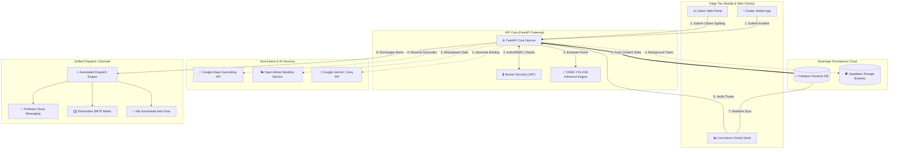

<div align="center">
  
  <h1> Agniveer — Wildfire Detection & Emergency Response Platform</h1>
  <p>
    <strong>A Sovereign, Enterprise-Grade Real-Time Wildfire Detection, AI Edge-Inference and Tactical Emergency Dispatch Orchestration System</strong>
  </p>

  <p>
    <a href="https://www.python.org/"></a>
    <a href="https://fastapi.tiangolo.com/"></a>
    <a href="https://flutter.dev/"></a>
    <a href="https://firebase.google.com/"></a>
    <a href="https://supabase.com/"></a>
    <a href="https://onnxruntime.ai/"></a>
  </p>
</div>

<br />

## 📖 System Overview

**Agniveer** is a mission-critical, full-stack disaster management platform designed to detect, track, verify, and report wildfires in real-time. By bridging the gap between citizen reporting and localized emergency response systems, the platform minimizes alert latency to sub-second thresholds.

```
       📱 Citizens / Mobile App      ──[Image & GPS]──►  ⚙️ FastAPI Gateway
       🌐 Command & Control Center    ◄──[Real-time DB]──   🧠 YOLO ONNX Model
       ⚡ Emergency Responders        ◄──[SMS/FCM/SMTP]──  🤖 LLM Tactical Agent
```

> [!IMPORTANT]
> Agniveer's architecture separates heavy processing operations (e.g. Supabase image uploading, weather API queries, Google Maps spatial geocoding, and LLM text generation) into an **asynchronous background queue** using FastAPI background tasks. This ensures immediate HTTP response returns (`201 Queued`) to edge mobile devices, preventing data timeouts under poor signal conditions.

---

## 🏗️ Distributed System Architecture


```mermaid
graph TD
    %% Edge Tier
    subgraph "Edge Tier (Mobile & Web Clients)"
        A["📱 Flutter Mobile App"]
        W["🌐 Citizen Web Portal"]
        D["📊 Live Admin Control Desk"]
    end

    %% API Gateway
    subgraph "API Core (FastAPI Gateway)"
        API["⚙️ FastAPI Core Service"]
        AUTH["🔒 Bearer Security (JWT)"]
        ONNX["🧠 ONNX YOLO26 Inference Engine"]
    end

    %% Cloud Storage & DB
    subgraph "Sovereign Persistence Cloud"
        DB[("🔥 Firebase Firestore DB")]
        ST[("🪣 Supabase Storage Buckets")]
    end

    %% Third-party APIs
    subgraph "Enrichment & AI Services"
        GEO["📍 Google Maps Geocoding API"]
        WEA["🌤️ Open-Meteo Weather Service"]
        LLM["🤖 Google Gemini / Groq API"]
    end

    %% Alert Dispatch
    subgraph "Unified Dispatch Channels"
        DISP["⚡ Automated Dispatch Engine"]
        FCM["📲 Firebase Cloud Messaging"]
        SMTP["✉️ Redundant SMTP Mailer"]
        N8N["🤖 n8n Automated Alert Flow"]
    end

    %% Data Flows
    A -->|1. Submit Incident | API
    W -->|1. Submit Citizen Sighting| API
    API <-->|2. Auths/RBAC Checks| AUTH
    API -->|3. Evaluate Frame| ONNX
    API -.->|4. Background Tasks| ST
    API -.->|4. Reverse Geocodes| GEO
    API -.->|4. Atmospheric Data| WEA
    API -.->|5. Generate Briefing| LLM
    API ===|6. Push Incident State| DB
    DB <===|7. Realtime Sync| D
    D -->|8. Verify Threat| API
    API -->|9. Discharges Alerts| DISP
    DISP --> FCM
    DISP --> SMTP
    DISP --> N8N
```

### Core Architecture Layers

1. **Edge Surveillance & Collection:** Citizen and surveillance teams run a **Flutter cross-platform application** to capture high-definition photographs and query precise hardware GPS coordinates (`latitude`, `longitude`). A lightweight web portal allows public-facing citizen submissions without authentication.
2. **API & Model Execution Gateway:** Built with **FastAPI** hosted behind high-performance `gunicorn` + `uvicorn` worker nodes. It processes binary payloads, passes flattened image arrays into an optimized **ONNX YOLO26 Deep Learning Model** to detect smoke/fire signatures, and validates client security tokens.
3. **Sovereign Persistence Cloud:** 
   - **Firestore:** Manages unstructured fast-moving real-time database documents. Detections transition dynamically through state lifecycles (`pending` ──► `verified` ──► `contained` / `false_alarm` ──► `resolved`).
   - **Supabase Storage:** Evidentiary images are safely transferred into custom public storage buckets, bypassing local storage constraints and avoiding heavy database bloat.
4. **Enrichment & Context Engines:** Detections are hydrated asynchronously in the background. It decodes coordinate bounding spheres using reverse-geocoding, parses meteorological statistics (temperature, wind velocity, humidity), and targets nearby fire station agencies.
5. **AI Tactical Synthesis Agent:** Once verified, an integrated LLM service (powered by **Google Gemini** or **Groq LLaMA3**) takes active metrics (wind vector, thermal indices, weather conditions, local assets) and writes an automated, highly-structured **Tactical Response Plan** for command authorities.
6. **Emergency Alert dispatcher:** Automatically fires high-priority alerts across email channels (SMTP), citizen push notifications (FCM tokens), and visual dashboards.

---

## 📂 Project Directory Structure

```text
Wildfire_Detection/
├── Agniveer_Project_Simple_Report.pdf   # Complete institutional project report
├── check_backend.py                     # Root service accessibility script
├── render.yaml                          # Render deployment blueprint configuration
├── Project_Fire/
│   ├── automation/                      # Automatic workflows and alert integrations
│   │   ├── WORKFLOW_SETUP.md            # n8n credential deployment instructions
│   │   └── workflows/
│   │       └── fire-alert.json          # Pre-configured n8n workflow pipeline
│   ├── backend/                         # FastAPI core codebase & deep learning model
│   │   ├── .env.example                 # Environment configuration template
│   │   ├── requirements.txt             # Python runtime dependencies
│   │   ├── runtime.txt                  # Python environment target version
│   │   ├── RENDER_FIREBASE_CREDENTIALS.md # Render custom setup instructions
│   │   ├── test_notifications.py        # Independent notification check script
│   │   └── api/                         # Primary backend modules
│   │       ├── main.py                  # Server initializations, CORS, and health routing
│   │       ├── config/
│   │       │   └── settings.py          # Pydantic Settings implementation
│   │       ├── models/
│   │       │   ├── check.py             # Streamlit-based Web UI model inspector
│   │       │   ├── detection.py         # PyDantic models for schema enforcement
│   │       │   └── fire_model.onnx      # Pre-trained YOLO26 Wildfire ONNX weight
│   │       ├── routes/                  # Controller endpoints
│   │       │   ├── auth.py              # Identity administration & token management
│   │       │   ├── detections.py        # Main incident endpoints (reporting & search)
│   │       │   ├── inference.py         # Direct ONNX prediction & mobile reports
│   │       │   └── notifications.py     # Channel status routing & webhooks
│   │       └── services/                # Specialized domain services
│   │           ├── firebase_service.py  # Firestore connection & storage bindings
│   │           ├── geocoding_service.py # Spatial computation & station decoders
│   │           ├── llm_service.py       # Gemini / Groq tactical analysis agent
│   │           ├── notification_service.py # Core SMTP / FCM / n8n dispatch mechanics
│   │           ├── onnx_inference.py    # YOLO26 pre-processor & tensor evaluator
│   │           ├── redis_service.py     # Performance caching wrapper
│   │           ├── stats_service.py     # Real-time telemetry aggregator
│   │           ├── supabase_service.py  # Supabase object storage pipeline
│   │           └── weather_service.py   # Meteorological Open-Meteo client
│   ├── frontend/                        # Tactical Visualizations
│   │   └── legacy_v1/                   # Production-grade web interface
│   │       ├── index.html               # Main public telemetry dashboard
│   │       ├── admin.html               # Secure verification operations portal
│   │       ├── tailwind.config.js       # CSS styling variables
│   │       ├── css/                     # Sleek design sheets
│   │       └── js/                      # Dashboard logic & map scripts
│   │           ├── main.js              # Command center UI engine
│   │           ├── admin.js             # Verification operations handler
│   │           ├── map.js               # Leaflet spatial display logic
│   │           ├── config.js            # Environment path endpoints
│   │           └── firebase-config.js   # Client-side web configurations
│   ├── mobile_app/                      # Mobile Applications
│   │   └── flutter_app/                 # Flutter mobile client project
│   │       ├── pubspec.yaml             # Flutter dependencies list
│   │       ├── analysis_options.yaml    # Flutter lint guidelines
│   │       ├── assets/                  # App images & custom icons
│   │       └── lib/                     # Flutter source code
│   │           ├── main.dart            # Flutter app bootloader
│   │           ├── screens/             # UI screens (Capture, Feeds, Profile)
│   │           ├── providers/           # Shared state management provider
│   │           ├── services/            # API integration & local notifier services
│   │           └── utils/               # Helper routines & assets mappings
│   └── scripts/                         # Maintenance and diagnostic helpers
│       ├── create_simple_pdf.py         # Automated PDF generation pipeline
│       ├── test_model.py                # Standalone ONNX prediction validation
│       └── verify_supabase.py           # Supabase bucket connectivity validation
```

---

## 🚀 Step-by-Step Launch & Setup

Follow these single-line command paths to configure and execute each service locally.

### 1️⃣ Core Backend API Setup

Prepare a virtual python environment, install technical dependencies, and load the FastAPI server:

```powershell
# Navigate into backend directory
cd Project_Fire/backend

# Create virtual environment
python -m venv env_fire

# Activate virtual environment (Windows Powershell)
.\env_fire\Scripts\Activate.ps1

# Upgrade package installer & download all requirements
pip install --upgrade pip; pip install -r requirements.txt

# Launch FastAPI gateway under local hot-reloader
uvicorn api.main:app --host 0.0.0.0 --port 8000 --reload
```

---

### 2️⃣ Streamlit ONNX Model Inspector

To test the pre-trained YOLOv8 ONNX weights (`fire_model.onnx`) directly on test images or through your system camera:

```powershell
# Ensure you are inside the active virtual environment and navigate to the models directory
cd Project_Fire/backend/api/models

# Run the Streamlit inspection dashboard
streamlit run check.py
```

---

### 3️⃣ Web Tactical Command Dashboard

Serve the visual frontend client locally. The page updates automatically by connecting directly with the backend API endpoints:

```powershell
# Navigate to the frontend legacy folder
cd Project_Fire/frontend/legacy_v1

# Serve the static pages using Python's quick HTTP server
python -m http.server 3000
```
> Open **`http://localhost:3000/index.html`** in your browser to view the Command Center, or **`http://localhost:3000/admin.html`** for administrative verification controls.

---

### 4️⃣ Flutter Mobile App Launch

Compile and start the Android or iOS smartphone application:

```powershell
# Navigate into the mobile application workspace
cd Project_Fire/mobile_app/flutter_app

# Fetch application dependencies
flutter pub get

# Launch the app on connected emulator/device pointing at the local server
flutter run --dart-define=API_BASE_URL=http://localhost:8000/api

# OR run and point directly to the deployed production Render service
flutter run --dart-define=API_BASE_URL=https://wildfire-detection-backend.onrender.com/api
```

---

### 5️⃣ Diagnostic Connectivity Checks

Validate that the systems are operational using the preconfigured diagnostic scripts:

```powershell
# Check Supabase Storage credentials & buckets
python Project_Fire/scripts/verify_supabase.py

# Verify YOLO ONNX model file compatibility & test prediction
python Project_Fire/scripts/test_model.py

# Test backend REST health endpoint
python check_backend.py
```

---

## 🔒 Configuration & Environment Variables

Create a file named `.env` at **`Project_Fire/backend/.env`** based on the `.env.example` file.

| Configuration Key | Example / Default Value | Purpose |
| :--- | :--- | :--- |
| **`ENVIRONMENT`** | `development` | Set to `production` or `development` to toggle safety rules. |
| **`DEBUG`** | `False` | Toggles detailed traceback output and development routes. |
| **`FIREBASE_CREDENTIALS`** | `firebase-credentials.json` | Local file path referencing your Firebase Admin SDK service account. |
| **`FIREBASE_CREDENTIALS_JSON`**| `{...}` | Complete Firebase JSON config as a string (primarily for Render cloud). |
| **`FIREBASE_PROJECT_ID`** | `agniveer-fire-app` | Your Google Cloud project ID. |
| **`FIREBASE_STORAGE_BUCKET`** | `agniveer-fire.appspot.com` | Google Cloud storage bucket path. |
| **`SUPABASE_URL`** | `https://xx.supabase.co` | Supabase endpoint URL for high-resolution image uploads. |
| **`SUPABASE_ANON_KEY`** | `eyJhbGciOiJIUzI1Ni...` | Supabase public API key for storage bucket write privileges. |
| **`SUPABASE_BUCKET_NAME`** | `detections` | Target folder inside Supabase bucket. |
| **`SMTP_SERVER`** | `smtp.gmail.com` | SMTP host used to dispatch email warnings. |
| **`SMTP_PORT`** | `587` | Standard SMTP port for secure TLS transmission. |
| **`EMAIL_USER`** | `alerts@domain.com` | Sender account for automated emergency emails. |
| **`EMAIL_PASSWORD`** | `xxxx xxxx xxxx xxxx` | App-specific password (bypasses multi-factor auth). |
| **`EMERGENCY_EMAILS`** | `chief@station.org,hq@fire.gov`| Comma-separated target emergency emails. |
| **`GOOGLE_MAPS_API_KEY`** | `AIzaSyB...` | Key used for reverse geocoding addresses and locating nearby stations. |
| **`JWT_SECRET_KEY`** | `your-secret-key-change-this` | Cryptographic signature string used to create client access tokens. |
| **`N8N_PASSWORD`** | `n8n-alert-verification` | Secret hash to authorize communication with n8n workflow triggers. |
| **`GEMINI_API_KEY`** | `AIzaSyC...` | API Key for Google Gemini LLM used in tactical briefing generation. |
| **`GROQ_API_KEY`** | `gsk_...` | API Key for Groq LLaMA3 LLM (used as an alternative LLM). |

---

## 📡 REST API Reference

All backend endpoints are prefixed with `/api`. Open `http://localhost:8000/api/docs` for the interactive Swagger UI.

### 1. Detections Router (`/api/detections`)

| Method | Endpoint | Auth | Description | Payload Formats |
| :--- | :--- | :---: | :--- | :--- |
| **`POST`** | `/report` | Yes | Uploads fire photo and queues background geolocation mapping. | Multipart Form: `image` (binary), `latitude` (float), `longitude` (float), `confidence` (float) |
| **`POST`** | `/citizen-report` | No | Direct citizen report bypasses token requirements to alert admins. | Multipart Form: `image` (optional), `location` (text), `description` (text), `latitude`, `longitude` |
| **`GET`** | `/` | No | Fetches a historical log of wildfire reports with filter capabilities. | Query parameters: `limit`, `status`, `severity`, `start_date`, `end_date` |
| **`GET`** | `/active` | No | Fetches active incidents currently in `pending` or `verified` status. | None |
| **`GET`** | `/{detection_id}` | No | Returns the full hydated metadata of a single detection by ID. | Path Parameter: `detection_id` |
| **`PUT`** | `/{detection_id}` | Yes | Updates status, severity, or notes. Triggers emergency alerts if set to `verified`. | JSON: `{"status": "verified", "severity": "critical", "notes": "Wind speed accelerating"}` |
| **`DELETE`**| `/{detection_id}` | Yes | Permanently removes an incident record from the Firestore database. | Path Parameter: `detection_id` |
| **`GET`** | `/{detection_id}/nearby-stations` | No | Retrieves emergency services near the incident's coordinates. | Path Parameter: `detection_id` |
| **`POST`** | `/{detection_id}/generate-ai-report`| No | Triggers LLM report generation for incident briefing. | Path Parameter: `detection_id` |

### 2. Deep Learning Inference Router (`/api/inference`)

| Method | Endpoint | Auth | Description | Payload Formats |
| :--- | :--- | :---: | :--- | :--- |
| **`POST`** | `/detect` | No | Runs ONNX model directly. Creates Firestore record and alerts if confidence exceeds 70%. | Multipart Form: `image` (binary), `lat` (float), `lng` (float) |

### 3. Authentication Router (`/api/auth`)

| Method | Endpoint | Auth | Description | Payload Formats |
| :--- | :--- | :---: | :--- | :--- |
| **`POST`** | `/register` | No | Signs up a new administrator or citizen surveillance scout. | JSON: `{"email": "...", "password": "...", "name": "..."}` |
| **`POST`** | `/login` | No | Validates passwords and generates a Bearer JWT access token. | JSON: `{"username": "...", "password": "..."}` (OAuth2 Form) |
| **`GET`** | `/me` | Yes | Retrieves profile info of the currently logged-in administrator. | Bearer Token in Header |

---

## 🧠 Deep Learning & Generative AI Pipelines

```
               [ Input Frame: JPEG/PNG ]
                          │
                          ▼
            [ Preprocess: Resize to 640x640 ]
                          │
                          ▼
            [ Normalize Pixels: 0.0 - 1.0 ]
                          │
                          ▼
             [ Transpose: HWC to CHW format ]
                          │
                          ▼
           [ Expand Dimensions: [1, 3, 640, 640] ]
                          │
                          ▼
            [ run ONNX Inference Engine ]
                          │
                          ▼
      [ Parse output: [1, 300, 6] prediction tensor ]
                          │
                          ▼
    [ Decode bounding boxes & confidence score metrics ]
```

### 🔹 1. ONNX Inference Service (`onnx_inference.py`)
Rather than relying on resource-intensive frameworks (like PyTorch) in production, Agniveer loads pre-trained **YOLO26 weights** converted to **Open Neural Network Exchange (ONNX)** format.
- **Image Preprocessing:** Incoming files are normalized to a `[0.0 - 1.0]` scale, resized to exactly `640x640` pixels, transposed from standard Height-Width-Channel (HWC) to Channel-Height-Width (CHW), and wrapped in a batch dimension: `[1, 3, 640, 640]`.
- **Tensor Output Parsing:** The engine processes the feed and evaluates output predictions shaped as `[1, 300, 6]`. Each bounding prediction decodes as `[x_center, y_center, width, height, confidence_score, class_id]`.
- **Self-Healing Mock System:** If the model weights are not found, the service switches to a safe **mock fallback mode**, generating validation responses to keep the core server active.

### 🔹 2. LLM Tactical Intelligence Generator (`llm_service.py`)
When a major wildfire threat is verified, the system combines real-time incident metrics with generative LLMs (Google Gemini or Groq LLaMA3) to build a **Tactical Response Plan**:

```text
Inputs:
├── Latitude/Longitude: 32.2190, 76.3234
├── Reverse Geocoding: "Dharamshala, Himachal Pradesh, India"
├── Weather Snapshot: Wind: 14 km/h SW, Temp: 32°C, Humidity: 28%
├── Nearby Fire Stations: "Dharamshala Central Fire Station (1.2 km)"
└── Confidence metrics: 92.4% (YOLO Detection)

Generative AI Synthesis Loop (Gemini-1.5-Flash / LLaMA3-8B):
├── Analyzes local wind propagation risk vectors
├── Evaluates atmospheric moisture dryness factors
└── Designs tactical fire suppression recommendations
```

The resulting `ai_tactical_report` is saved back to Firestore to help emergency responders plan their tactical actions.

---

## 🤖 n8n Automation Workflows

```
  [ Firestore verified update ] ──► [ n8n Webhook Listener ] ──► [ FCM Push Service ]
                                                                      │
                                                                      ├──► [ Twilio SMS API ]
                                                                      └──► [ SMTP Email Alert ]
```

Agniveer includes automated workflow configuration at `Project_Fire/automation/workflows/fire-alert.json` designed for the **n8n platform**.

### Setup n8n Push Notification Workflows

1. Open your local or cloud n8n dashboard (usually running on port `5678`).
2. Select **Credentials** on the left menu, then click **Add Credential** in the top right.
3. Choose **Google Firebase Cloud Messaging** as the type.
4. Copy the entire contents of your active `backend/firebase-credentials.json` and paste it inside the **Service Account Key** text field in n8n. Save your credentials.
5. Import `fire-alert.json` into n8n.
6. Open the **Send Push Notification** node inside your imported workflow, and select the Firebase credentials you created from the dropdown menu. n8n will now handle token refreshing automatically.

---

## 🛠️ Troubleshooting Guide

### 🚨 Problem: ONNX Runtime installation fails on Windows
- **Cause:** ONNX Runtime requires specific Visual C++ Redistributable packages.
- **Solution:** Download and install the [Microsoft Visual C++ Redistributable](https://aka.ms/vs/17/release/vc_redist.x64.exe).

### 🚨 Problem: `Firebase app already exists` or initialization exceptions
- **Cause:** Hot-reloading in FastAPI can attempt to initialize the Firebase Admin SDK multiple times on the same process.
- **Solution:** Agniveer uses a check to initialize the Firebase application only if there are no existing apps in the registry:
  ```python
  import firebase_admin
  if not firebase_admin._apps:
      firebase_admin.initialize_app(credentials)
  ```

### 🚨 Problem: Supposedly "Fake" or "Mock" detections are occurring
- **Cause:** The system cannot locate the YOLO26 weight file `fire_model.onnx` at `backend/api/models/`.
- **Solution:** Check that the 38.9MB file `fire_model.onnx` exists in that folder. If it is missing, download it and place it in the folder to enable live predictions.

### 🚨 Problem: CORS connection blocks communication between dashboard and local backend
- **Cause:** Browser security prevents web apps loaded from file systems or differing ports from making API calls.
- **Solution:** Our FastAPI initialization includes configuration to allow traffic from all origins during testing:
  ```python
  app.add_middleware(
      CORSMiddleware,
      allow_origins=["*"],
      allow_credentials=False,
      allow_methods=["GET", "POST", "PUT", "DELETE", "OPTIONS"],
      allow_headers=["*"],
  )
  ```

---

## 🛡️ Security Best Practices
- **Never Commit Secrets:** Do not commit `firebase-credentials.json` or your `.env` file to your GitHub repository.
- **Configure Render Env Vars:** In production environments (such as Render), paste the JSON config directly into the `FIREBASE_CREDENTIALS_JSON` environment variable.
- **Disable Local Storage Fallback:** For high-throughput production workloads, ensure the Supabase image upload is active so server storage does not fill up.

---
<div align="center">
  <p><strong>Agniveer Emergency Surveillance • Sovereign Wildfire Defence Infrastructure • 2026 (Central University Of Himachal Pradesh)</strong></p>
</div>
