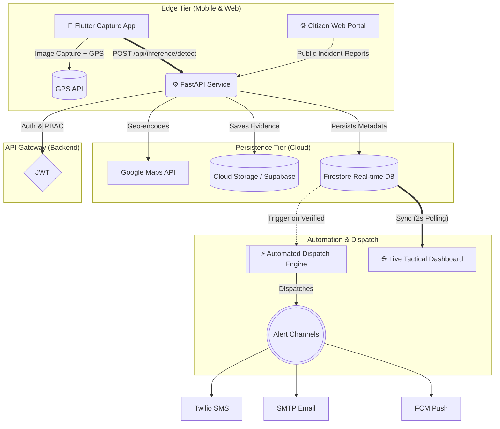

<div align="center">
  
  <h1>🔥 Agniveer — Wildfire Detection System</h1>
  <p>
    <strong>A Sovereign, Enterprise-Grade Real-Time Wildfire Detection and Emergency Response Platform</strong>
  </p>

  <p>
    <a href="https://www.python.org/"></a>
    <a href="https://fastapi.tiangolo.com/"></a>
    <a href="https://flutter.dev/"></a>
    <a href="https://firebase.google.com/"></a>
  </p>
</div>

<br />

## 📖 Overview

**Agniveer** is a mission-critical, full-stack platform engineered to detect and mitigate wildfires in real-time. The mobile app captures images and coordinates, while the backend runs ONNX-based inference and stores detections in Firestore.

> [!IMPORTANT]
> This system is designed for public safety and emergency response. It combines edge computing with cloud orchestration to provide a sub-second response loop between detection and alert.

---

## 📑 Table of Contents
- [🏗️ System Architecture](#️-system-architecture)
- [✨ Key Features](#-key-features)
- [📂 Project Layout](#-project-layout)
- [🚀 Quick Start](#-quick-start)
- [🔒 Configuration](#-configuration)
- [🔍 Troubleshooting](#-troubleshooting)
- [🛡️ Security](#️-security)

---

## 🏗️ System Architecture

Agniveer is built upon a distributed microservices architecture designed for low latency and high availability.


```mermaid
graph TD
    subgraph "Edge Tier (Mobile & Web)"
        A[📱 Flutter Capture App]
        W[🌐 Citizen Web Portal]
        A -->|Image Capture + GPS| GPS[(GPS API)]
        W -->|Public Incident Reports| B
    end

    subgraph "API Gateway (Backend)"
        B(⚙️ FastAPI Service)
        B -->|Auth & RBAC| AUTH{JWT}
    end

    subgraph "Persistence Tier (Cloud)"
        C[(Firestore Real-time DB)]
        D[(Cloud Storage / Supabase)]
        MAPS[Google Maps API]
    end

    subgraph "Automation & Dispatch"
        E[🌐 Live Tactical Dashboard]
        F[[⚡ Automated Dispatch Engine]]
        G(((Alert Channels)))
    end

    %% Data Flows
    A == "POST /api/inference/detect" ==> B
    B -- "Geo-encodes" --> MAPS
    B -- "Saves Evidence" --> D
    B -- "Persists Metadata" --> C
    
    C -. "Trigger on Verified" .-> F
    C == "Sync (2s Polling)" ==> E
    
    F -- "Dispatches" --> G
    G --> SMS[Twilio SMS]
    G --> EMAIL[SMTP Email]
    G --> PUSH[FCM Push]
```

### 🔹 1. Mobile Capture Tier
The Flutter app captures a frame and sends it to the backend with GPS coordinates when available. The app does not run the production model locally.

### 🔹 2. API Gateway & Processing Tier
Powered by **FastAPI** running atop `gunicorn` + `uvicorn`, the backend ingests image data, runs ONNX inference, decodes spatial coordinates, and reverse-geocodes incidents via the Google Maps API.

### 🔹 3. Data Persistence Tier
- **Firestore:** Manages unstructured fast-moving data with instantaneous cross-client synchronization and 2-second tactical polling.
- **Supabase:** High-resolution evidentiary images are piped into optimized object buckets with secure backend-only mutation logic.

### 🔹 4. Event-Driven Alert Dispatcher
When a detection is verified by an administrator, it triggers a custom notification engine. This detaches alert logic from the core processing loop, ensuring high-reliability multi-channel delivery across SMS, Email, and Push notifications via Twilio and SMTP.

---

## ✨ Key Features

- **📱 Mobile Capture Flow**: Flutter app sends image + GPS coordinates to the backend.
- **🤝 Citizen Verification Workflow**: Public reporting portal where citizens submit sightings; admins then verify, solve, or flag reports as fake.
- **📍 Real-Time Geocoding**: Automatically tags exact latitudes/longitudes and reverse maps the closest fire authorities.
- **✉️ Redundant Alert Orchestration**: Parallel SMS (Twilio), Email (SMTP), and Push (FCM) notifications.
- **🌐 Tactical Command Dashboard**: High-frequency (2s) real-time surveillance featuring unified verified incident feeds.
- **🧠 ONNX Edge Inference**: Optimized backend model source at `Project_Fire/backend/api/models/fire_model.onnx`.
- **🔐 Secure API Orchestration**: Role-Based Access Control (RBAC) ensuring all sensitive mutations bypass client-side rules.

---

## 📂 Project Layout

```text
Project_Fire/
├── automation/                 # Custom notification workflows & alert scripts
├── backend/                    # FastAPI source code & core AI logic
│   └── api/                    # Core API implementation
├── frontend/                   # Tactical Web dashboards (Public & Admin)
│   └── legacy_v1/              # Production-ready dashboard source
├── mobile_app/                 # Flutter mobile application
│   └── flutter_app/            # Main Flutter project
└── scripts/                    # Maintenance & utility scripts
```

---

## 🚀 Quick Start

### 1. Unified Setup

The platform is designed to run with a FastAPI backend and a Flutter mobile client.

> [!TIP]
> **Default Access Points:**
> - API Documentation: `http://localhost:8000/api/docs`
> - Legacy Dashboard: Open `Project_Fire/frontend/legacy_v1/index.html` in a browser.

---

### 2. Manual Setup

#### **A. Backend Setup**
```bash
cd Project_Fire/backend
python -m venv env_fire
source env_fire/bin/activate  # Windows: .\env_fire\Scripts\activate
pip install -r requirements.txt
uvicorn api.main:app --host 0.0.0.0 --port 8000
```

#### **B. Render Deployment**
- Root Directory: `Project_Fire/backend`
- Build Command: `pip install --upgrade pip && pip install -r requirements.txt`
- Start Command: `gunicorn api.main:app -k uvicorn.workers.UvicornWorker --bind 0.0.0.0:$PORT --workers 1 --timeout 120`
- Python Version: `3.11.11`

- Required env vars on Render:
  - `FIREBASE_CREDENTIALS_JSON`
  - `FIREBASE_PROJECT_ID`
  - `FIREBASE_STORAGE_BUCKET`
  - `SUPABASE_URL`
  - `SUPABASE_ANON_KEY`
  - `JWT_SECRET_KEY`
  - `GOOGLE_MAPS_API_KEY`

#### **C. Frontend Website**
```bash
cd Project_Fire/frontend/legacy_v1
# Serve using any static server, e.g., Python:
python -m http.server 3000
```

Live admin panel:
- `https://wildfire-detection-cuhp.vercel.app/admin_secure_locked.html`

#### **D. Flutter App**
```bash
cd Project_Fire/mobile_app/flutter_app
flutter pub get
flutter run --dart-define=API_BASE_URL=https://wildfire-detection-d1em.onrender.com/api
```

For mobile builds, always point `API_BASE_URL` at the deployed Render backend unless you are testing on a local server.

---

## 🔒 Configuration

Configure the environment variables in `Project_Fire/backend/.env` for local development. A template is provided at `Project_Fire/backend/.env.example`.

| Variable | Description |
| :--- | :--- |
| `FIREBASE_PROJECT_ID` | Your Google Cloud Project ID. |
| `FIREBASE_CREDENTIALS_JSON` | Firebase service-account JSON for Admin SDK access. |
| `SUPABASE_URL` | Your Supabase infrastructure URL for storage. |
| `EMAIL_USER` | SMTP username for email alerts. |
| `EMAIL_PASSWORD` | App-specific password for SMTP authentication. |
| `EMERGENCY_EMAILS` | Comma-separated list of authority recipients. |
| `GOOGLE_MAPS_API_KEY` | Key for Geocoding and reverse mapping. |
| `JWT_SECRET_KEY` | Secret key for JWT signing. |

---

## 🔍 Troubleshooting this side

- **Server Connection Errors**: Verify `FIREBASE_CREDENTIALS_JSON` is set in Render and that the backend health endpoint is healthy.
- **Mobile Sync Issues**: Ensure the Flutter app uses the Render API base URL, not a local Wi-Fi IP.
- **Dashboard Data Lag**: Check Firestore access and confirm the admin panel is pointed at the deployed backend.
- **Model Path Issues**: The deployed model is loaded from `Project_Fire/backend/api/models/fire_model.onnx`.

---

## 🔐 Security Note

Do not commit `firebase-credentials.json` or any raw Firebase service-account key to GitHub. Use `FIREBASE_CREDENTIALS_JSON` in Render instead.

---
